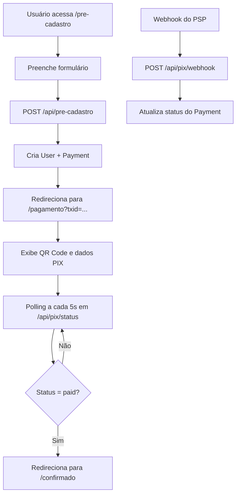

# PIX SaaS Learning

Sistema SaaS de aprendizado com integração PIX - MVP funcional completo.

## 🎯 Objetivo

Este projeto demonstra como implementar um sistema SaaS com integração PIX, incluindo:

- ✅ Formulário de pré-cadastro
- ✅ Geração de cobrança PIX
- ✅ QR Code e dados para pagamento
- ✅ Polling automático de status
- ✅ Webhook para confirmação
- ✅ Página de confirmação
- ✅ Arquitetura escalável com adapters

## 🚀 Tecnologias

- **Frontend**: Next.js 14+ (App Router) + TypeScript
- **Styling**: Tailwind CSS
- **Database**: Prisma + SQLite
- **Validação**: Zod
- **Testes**: Vitest
- **Linting**: ESLint + Prettier
- **Git Hooks**: Husky

## 📋 Pré-requisitos

- Node.js 18+ 
- npm ou yarn
- Git

## 🛠️ Instalação

1. **Clone o repositório**
   ```bash
   git clone <url-do-repositorio>
   cd pix-saas-learning
   ```

2. **Instale as dependências**
   ```bash
   npm install
   ```

3. **Configure as variáveis de ambiente**
   ```bash
   cp env.example .env
   ```
   
   Edite o arquivo `.env` com suas configurações:
   ```env
   # App
   NEXT_PUBLIC_APP_NAME="PIX SaaS Learning"
   
   # PIX (mock por padrão)
   PIX_PROVIDER="mock"
   PIX_FIXED_AMOUNT_CENTS=990   # R$ 9,90
   PIX_KEY="chave-pix-exemplo@dominio.com"
   WEBHOOK_SECRET="troque-isto-no-ambiente-real"
   
   # DB
   DATABASE_URL="file:./dev.db"
   ```

4. **Configure o banco de dados**
   ```bash
   npm run db:generate
   npm run db:push
   ```

5. **Inicie o servidor de desenvolvimento**
   ```bash
   npm run dev
   ```

6. **Acesse a aplicação**
   ```
   http://localhost:3000
   ```

## 📁 Estrutura do Projeto

```
pix-saas-learning/
├── app/                          # Next.js App Router
│   ├── api/                      # APIs
│   │   ├── pre-cadastro/         # POST: cria user+payment
│   │   └── pix/                  # APIs PIX
│   │       ├── status/           # GET: status por txid
│   │       └── webhook/          # POST: callback do PSP
│   ├── pre-cadastro/             # Página de cadastro
│   ├── pagamento/                # Página de pagamento
│   └── confirmado/               # Página de confirmação
├── components/                   # Componentes React
│   ├── forms/                    # Formulários
│   └── ui/                       # Componentes de UI
├── lib/                          # Bibliotecas e utilitários
│   ├── pix/                      # Gateway PIX
│   │   ├── IPixGateway.ts        # Interface
│   │   ├── MockPixGateway.ts     # Implementação mock
│   │   └── index.ts              # Factory
│   ├── validation.ts             # Schemas Zod
│   ├── prisma.ts                 # Cliente Prisma
│   └── env.ts                    # Validação de env
├── prisma/                       # Schema do banco
├── tests/                        # Testes
└── styles/                       # Estilos globais
```

## 🔄 Fluxo da Aplicação



## 🧪 Testes

### Executar testes
```bash
npm run test
```

### Executar testes em modo watch
```bash
npm run test:watch
```

### Testes implementados
- ✅ MockPixGateway.createCharge
- ✅ MockPixGateway.verifyPayment  
- ✅ MockPixGateway.handleWebhook

## 📝 Scripts Disponíveis

```bash
# Desenvolvimento
npm run dev          # Inicia servidor de desenvolvimento
npm run build        # Build para produção
npm run start        # Inicia servidor de produção

# Qualidade de código
npm run lint         # Executa ESLint
npm run lint:fix     # Corrige erros de lint automaticamente
npm run format       # Formata código com Prettier
npm run format:check # Verifica se o código está formatado
npm run typecheck    # Verifica tipos TypeScript
npm run check        # Executa todas as verificações
npm run fix          # Corrige lint e formata código

# Testes
npm run test         # Executa testes
npm run test:watch   # Executa testes em modo watch
npm run test:coverage # Executa testes com cobertura
npm run test:ui      # Abre interface visual dos testes

# Banco de dados
npm run db:generate  # Gera cliente Prisma
npm run db:push      # Aplica migrations
npm run db:studio    # Abre Prisma Studio
npm run db:reset     # Reseta banco de dados
```

## 🔧 Configuração de Gateway PIX Real

### Implementando EfiPixGateway

1. **Crie o arquivo** `lib/pix/EfiPixGateway.ts`:
```typescript
import { IPixGateway } from './IPixGateway';
import { CreateChargeRequest, CreateChargeResponse, StatusResponse } from '@/lib/validation';

export class EfiPixGateway implements IPixGateway {
  private apiKey: string;
  private baseUrl: string;

  constructor() {
    this.apiKey = process.env.EFI_API_KEY!;
    this.baseUrl = 'https://api-pix.gerencianet.com.br';
  }

  async createCharge(data: CreateChargeRequest): Promise<CreateChargeResponse> {
    // Implemente a integração com a API da EFI
    const response = await fetch(`${this.baseUrl}/v2/charge`, {
      method: 'POST',
      headers: {
        'Authorization': `Bearer ${this.apiKey}`,
        'Content-Type': 'application/json',
      },
      body: JSON.stringify({
        calendario: {
          expiracao: 3600
        },
        devedor: {
          nome: data.payer.name,
          cpf: data.payer.cpf,
        },
        valor: {
          original: (data.amountCents / 100).toFixed(2)
        },
        chave: process.env.PIX_KEY,
        solicitacaoPagador: `Pagamento ${data.txid}`
      })
    });

    const result = await response.json();
    
    return {
      copyPastePayload: result.pixCopyCola,
      key: process.env.PIX_KEY!,
      amountCents: data.amountCents,
      txid: data.txid,
    };
  }

  async verifyPayment(txid: string): Promise<StatusResponse> {
    // Implemente consulta de status
    const response = await fetch(`${this.baseUrl}/v2/charge/${txid}`, {
      headers: {
        'Authorization': `Bearer ${this.apiKey}`,
      }
    });

    const result = await response.json();
    
    return {
      status: result.status === 'CONCLUIDA' ? 'paid' : 'pending'
    };
  }

  async handleWebhook(req: NextRequest): Promise<{ txid: string; status: 'paid' | 'failed' }> {
    // Implemente validação de webhook da EFI
    const body = await req.json();
    
    // Validação da assinatura da EFI
    const signature = req.headers.get('x-gn-signature');
    // ... validação
    
    return {
      txid: body.pix[0].txid,
      status: body.pix[0].status === 'CONCLUIDA' ? 'paid' : 'failed'
    };
  }
}
```

2. **Atualize o factory** em `lib/pix/index.ts`:
```typescript
case 'efi':
  return new EfiPixGateway();
```

3. **Configure as variáveis de ambiente**:
```env
PIX_PROVIDER="efi"
EFI_API_KEY="sua-api-key-da-efi"
EFI_CLIENT_ID="seu-client-id"
EFI_CLIENT_SECRET="seu-client-secret"
```

### Implementando MPPixGateway

Siga o mesmo padrão para implementar a integração com Mercado Pago:

1. Crie `lib/pix/MPPixGateway.ts`
2. Implemente os métodos da interface
3. Atualize o factory
4. Configure as variáveis de ambiente

## 🔒 Segurança

### Variáveis de Ambiente
- ✅ Validação com Zod
- ✅ Arquivo `.env.example` sem segredos
- ✅ `.env` no `.gitignore`

### Webhook
- ✅ Validação de assinatura
- ✅ Tratamento de erros
- ✅ Logs de auditoria

### Banco de Dados
- ✅ Relacionamentos com foreign keys
- ✅ Índices únicos
- ✅ Soft deletes (quando necessário)

## 🚀 Deploy

### Vercel (Recomendado)
1. Conecte seu repositório ao Vercel
2. Configure as variáveis de ambiente
3. Deploy automático a cada push

### Outras plataformas
- **Railway**: Suporte nativo a Node.js
- **Heroku**: Adicione buildpack do Node.js
- **DigitalOcean App Platform**: Deploy direto do Git

## 🤝 Contribuindo

1. Fork o projeto
2. Crie uma branch para sua feature (`git checkout -b feature/nova-feature`)
3. Commit suas mudanças (`git commit -m 'feat: adiciona nova feature'`)
4. Push para a branch (`git push origin feature/nova-feature`)
5. Abra um Pull Request

### Padrões de Commit
- `feat:` Nova funcionalidade
- `fix:` Correção de bug
- `docs:` Documentação
- `style:` Formatação
- `refactor:` Refatoração
- `test:` Testes
- `chore:` Tarefas de manutenção

## 📄 Licença

Este projeto está licenciado sob a Licença MIT - veja o arquivo [LICENSE](LICENSE) para detalhes.

## 🆘 Suporte

- 📧 Email: suporte@pix-saas-learning.com
- 🐛 Issues: [GitHub Issues](https://github.com/seu-usuario/pix-saas-learning/issues)
- 📖 Documentação: [Wiki do projeto](https://github.com/seu-usuario/pix-saas-learning/wiki)

## 🙏 Agradecimentos

- Next.js Team
- Prisma Team
- Tailwind CSS
- Comunidade open source

---

**PIX SaaS Learning** - Aprendendo integração PIX de forma prática! 🚀
